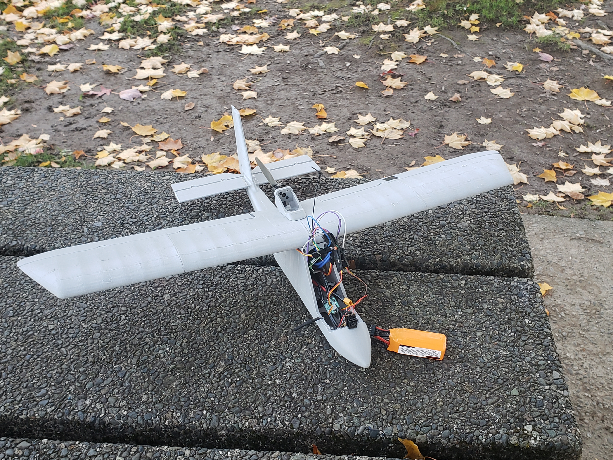

# Pico Plane

This mini-project explores programming a microcontroller to fly an FPV (First-Person View) plane using the **RP2040**. The plane uses an **ExpressLRS 2.4 GHz receiver** to receive control signals and is built using the freely available **[Micro SportCam](https://www.3daeroventures.com/microsportcam)** designed by 3DAeroventures.

## Project Goals
- Learn and practice embedded systems programming using the **RP2040 microcontroller**
- Improve our **C and C++ development skills** in a low-level environment
- Gain a deeper understanding of the **RP2040 architecture**, including its capabilities and limitations
- Find out if our software can allow a plane to fly without crashing

## State of the Project
This project is a **work in progress**. As life gets busy and priorities shift, development may slow down, but our goal is to complete the Pico Plane within a reasonable timeframe (ideally before the end of ~~2025~~ **2026**). 

So far, the **majority** of the code is **completed**. We are missing a few minor (but **critical!**) features required before takeoff. The plane should in theory fly with the current implementation (we are stilling working with the 3D print parts of the plane, it's proving to be quite a difficult process).

## Features
As mentioned, the code is designed for the RP2040 Pi Pico W. Our code features:
- Multicore flight controller
    - Core 0 parses CRSF frames & (soon!) IMU data to uSD card
    - Core 1 reads & applies the controls to the motors and servos
- PWM control for electronic speed controller (ESC) and servos (DS-M005)
- MPU6050 IMU via I2C
- CRSF communication using UART
- (soon!) MSP communication for FPV camera 

## Hardware List
To replicate our project, the following hardware are needed:
- x1 - Pi Pico W (or any RP2040/2350-based microcontroller)
- x1 - Brushless DC Motor
- x4 - DS-M005 servos
- x1 - MPU6050 IMU
- x1 - 4S LiPo battery
- x1 - 30A ESC with BEC
- x1 - FPV camera
- x1 - Buck converter (for powering camera from battery)
- x1 - ExpressLRS-based SpeedyBee Nano 2.4G receiver

Hardware may vary and other specifications may also work.

## Flight Log

| Year | Month / Day | Event | Notes |
| --- | --- | --- | --- |
| 2025 | June – Sep | Flight controller firmware | One ESC exploded |
|  | Oct 30 | Initial plane test | ESC failure, couldn't test |
|  | Nov | ESC fix attempts | New ESC ordered just in case |
| 2026 | Early May | New ESC installed | --- |
|  | May 4 | First flight test | Crashed |
|  | Sep 3 | Glide test | Plane glided, broke apart upon landing |
|  | 2nd week of Sep | Plane repairs | Expected |
|  | 2nd week of Sep | Plane ground-speed test | Expected |
|  | 2nd week of Sep | Second flight | Expected |

## Future plans
Here is our current to-do list:
- [ ] IMU data processing for AHRS (Attitude and Heading Reference System)
- [ ] Auto-pilot for takeoff & in-flight levelling

Possible future things (future projects?):
- [ ] Flight recorder using IMU and uSD card reader via SPI
- [ ] Flight data visualizations
- [ ] RTOS layer for multithreading
- [ ] DMA channels to read data from flight receiver

## Links
https://www.3daeroventures.com/microsportcam
